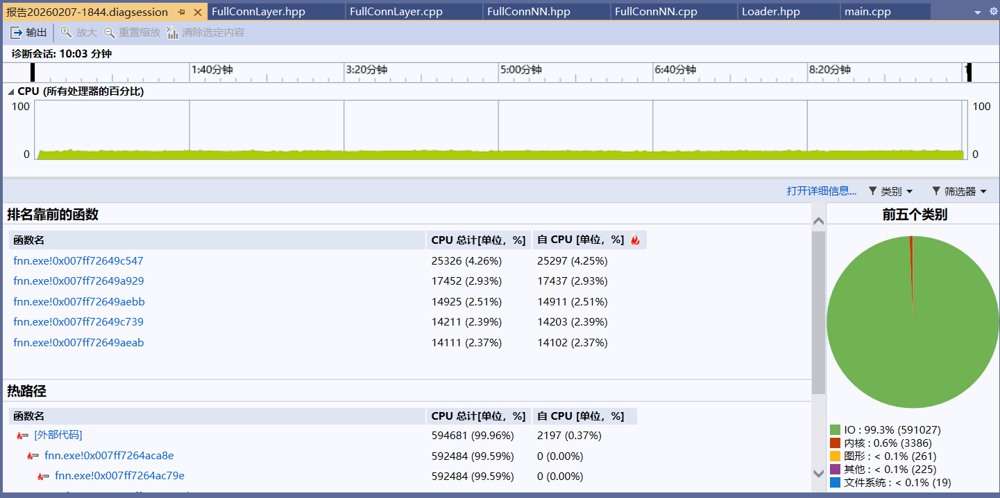

# fnn
## 1. 介绍
本项目计划基于C++11从零开始编写一个全连接神经网络，用最少的依赖实现网络的训练与推理。并在此基础上，通过一系列策略。如算法改进、内存分配优化、多线程等对其进行优化。

### 1.1 编译环境
#### 1.1.1 编译工具

| 工具 | 版本号 |
| --- |   ---  |
| gcc | 15.2.0 (x86_64-posix-seh-rev0, Built by MinGW-Builds project)|(x86_64-posix-seh-rev0, Built by MinGW-Builds project)|
| make | 4.4.1 |
| cmake| 4.0.2 |

#### 1.1.2 测试平台
- OS：Windows 11 家庭中文版 24H2
- CPU：Intel(R) Core(TM) i5-9300H CPU @ 2.40GHz (2.40 GHz)
- RAM：16GB
- SSD：1TB SAMSUNG MZVLB1T0HBLR-000L2

### 1.2 模型介绍
#### 1.2.1 网络结构
当前实现的神经网络结构如下：
- 输入层：784 个节点（对应 28x28 像素的图像）
- 隐藏层：300 个节点
- 输出层：10 个节点（对应 0-9 数字类别）

也可以通过`FullConnNN.hpp`对其进行自定义

#### 1.2.2 模型函数
- 激活函数：sigmoid
- 损失函数：MSE

#### 1.2.3 模型权重
训练过程产生两份权重文件，均存放于 weight/ 目录：
- `weight1.w` —— 经确定化随机种子生成的初始参数快照，用作训练起点，可确保全流程结果可复现；
- `weight.w` —— 训练收敛后的最终参数集，为模型推理之必需输入；
- 权重初始化：将权重初始化为 [-0.1, 0.1] 中间的随机值；
- 误区：初始化过程中权重对称，即不同结点与上一层各结点间权重值相同。若权重对称情况严重，可能使神经网络退化成多层单结点网络。

## 2. 快速开始
### 2.1 相关说明
本模型以 C++11 标准实现，核心训练流程不依赖任何第三方库。若需启用前端交互接口，须引入 cpp-httplib（MIT 许可，单头文件形式），将其 httplib.h 置于项目路径后重新编译；纯命令行训练场景下可跳过该步骤。

### 2.2 相关指令
```powershell
git clone https://github.com/YOUR_NAME/fnn.git
cd fnn
mkdir build && cd build
cmake -G "MinGW Makefiles" ..
mingw32-make
./fnn.exe
```

## 3. 数据集说明
本项目使用[MNIST数据集](https://yann.lecun.com/exdb/mnist/)。MNIST 数据集由 Yann LeCun、Léon Bottou、Yoshua Bengio 和 Patrick Haffner 提供。它最初发表于以下论文：
LeCun, Y., Bottou, L., Bengio, Y., & Haffner, P. (1998). Gradient-based learning applied to document recognition. Proceedings of the IEEE, 86(11), 2278-2324.

### 3.1 数据集规模
这是一个广泛用于机器学习和计算机视觉领域的手写数字图像数据集，具体规格如下：
- 训练集：60,000 张手写数字图像
- 测试集：10,000 张手写数字图像
- 图像规格：28×28 像素
- 图像内容：0~9 数字类别

### 3.2 数据集预处理
为了避免在代码中使用多余的库来对图片进行处理，所以提前将图片文件处理为文本文件（TXT），具体说明如下：
- 数据文件：包含train.txt（训练集）和test.txt（测试集）两个核心文件
- 数据格式：每行对应一组完整样本，共 785 个数值，以空格分隔
- 数值含义：首项为样本标注（数字 0~9），后续 784 项为图像按行扫描得到的像素灰度值，直接用于模型输入

## 4. 前端交互
为便于可视化验证模型效果，本项目提供基于 HTML 的前端演示界面，并通过 cpp-httplib 与后端进行数据交互。
请先编译并启动 fnn.exe，随后在浏览器中打开 index.html 即可使用。

## 5. 模型优化
后续优化将从算法改进、内存布局重构及多线程并行三个方向进行，每项变更均在同硬件环境下进行测试得到耗时，以粗略估计优化效果。每次版本发布将对应创建`Git tag`，方便代码的回溯与复现。
### 5.1 未优化项目（v1.0.0）
本版本采用未经任何相关优化的原始实现，单 epoch 训练耗时 583 800 ms，用作后续优化后版本性能对比的基准。

### 5.2 内存布局优化
经对比测试，预处理过的数据集与未处理的数据集运行速度上差异显著。预处理后的数据集带了的一定的可读性，但会显著增加程序运行时间成本，整体收益为负。权衡之下，决定使用原数据集。
```powershell
PS D:\Project\Github\du-xiang\fnn\test\build> ./loaderTest.exe
time: 200791ms
time: 938ms
```
实际使用二进制数据集，将其运用到程序中，时间好像未减少想象中这么多。可能也和系统调度导致cpu使用时间不确定？

将代码放到visual studio 2019中使用性能探查器，得到结果如下：

可以发现饼状图中IO占比高达99.3%。有些不符合直觉，但也侧面说明程序内存分配部分存在极大可优化空间。
将权重参数从二维vector改为一维vector。由于二维vector数据存储不连续，而训练与推理过程中对权重参数访问又极为符合空间局部性原理。所以将其变为一维vector。修改后运行发现程序时间大幅减少。
### 5.3 使用多线程

### 5.4 性能对比
|版本|耗时|准确率|优化点|git tag|
|---|---|---|---|---|
|v1.0.0|583800 ms|0.855400|未优化|v1.0.0|
|v2.0.0|345067 ms|0.896600|优化内存布局||

## 6. 致谢
本工作使用以下两项公开资源，谨向原作者及维护团队致以谢意：
1. MNIST 手写数字数据集
版权归属：Yann LeCun、Léon Bottou、Yoshua Bengio、Patrick Haffner
引文：LeCun Y., Bottou L., Bengio Y., Haffner P. Gradient-based learning applied to document recognition. Proceedings of the IEEE, 1998, 86(11): 2278-2324.
数据集获取地址：http://yann.lecun.com/exdb/mnist/

2. cpp-httplib
作者：Yuji Hirose (@yhirose)
项目地址：https://github.com/yhirose/cpp-httplib